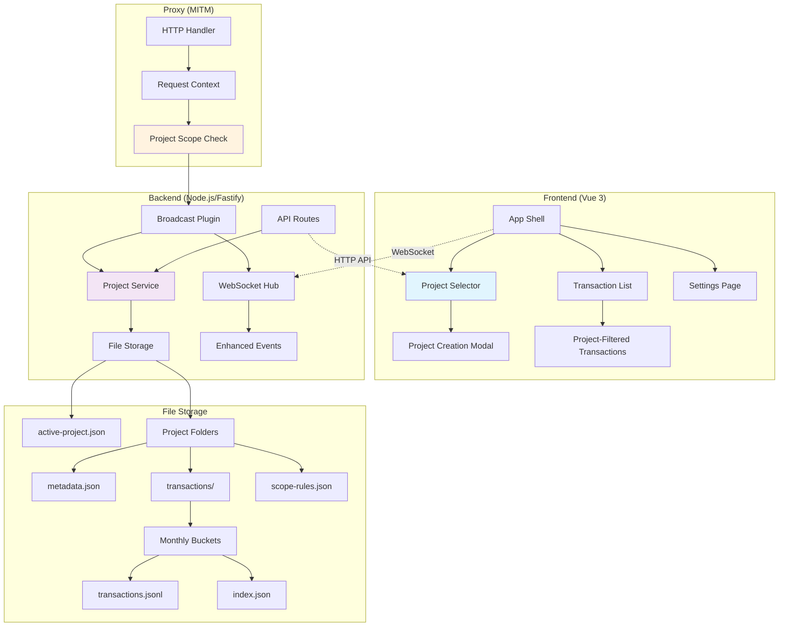

# Project Architecture Plan for Arachne

## Overview

This document outlines the comprehensive architecture for adding project support to Arachne, a web-based HTTP traffic analyzer and debugging tool. Projects will allow users to organize and scope their HTTP traffic analysis by creating isolated workspaces for different applications, environments, or testing scenarios.

## Current State Analysis

The current Arachne system consists of:
- **Frontend**: Vue 3 application with real-time transaction viewing via WebSocket
- **Backend**: Node.js with Fastify, broadcast plugin for real-time events
- **Proxy**: MITM proxy server with plugin architecture  
- **Data Flow**: Transactions flow through proxy → backend → WebSocket → frontend
- **Storage**: In-memory storage in frontend store (no persistence)

Since all current data is temporary and in-memory, no data migration is required.

## Project Data Model

### Core Project Entity

```typescript
interface Project {
    id: string                    // UUID
    name: string                  // User-defined name
    description?: string          // Optional description
    createdAt: string            // ISO timestamp
    lastActive: string           // ISO timestamp
    isActive: boolean            // Currently selected project
    settings: ProjectSettings
    metadata: ProjectMetadata
}

interface ProjectSettings {
    autoCapture: boolean         // Auto-capture new traffic
    retentionDays: number        // How long to keep transactions
    scopeRules: ScopeRule[]      // URL patterns to include/exclude
}

interface ScopeRule {
    id: string
    pattern: string              // URL pattern (glob or regex)
    type: 'include' | 'exclude'
    enabled: boolean
}

interface ProjectMetadata {
    transactionCount: number
    hostsCount: number
    lastTransactionAt?: string
    sizeBytes: number
}
```

## UI Integration Plan

### Header Enhancement

- Add **Project Selector** dropdown in the header next to the proxy toggle
- Add **"+ New Project"** button for quick project creation
- Show active project name prominently
- Project creation modal with name, description, and initial scope settings

### Navigation Updates

- Update `AppShell.vue` to include project context
- Add project management to the Settings page
- Show project statistics in the header or sidebar

### Transaction Association

- All transactions will be tagged with `projectId`
- Filter transactions by active project
- Visual indicators showing which project transactions belong to

## Backend Architecture Changes

### Project Service Layer

```typescript
// New: apps/backend/src/services/project-service.ts
class ProjectService {
    private activeProjectId: string | null = null
    private projectsBasePath: string = path.join(os.homedir(), '.arachne', 'projects')
    
    // Project CRUD operations
    createProject(data: CreateProjectRequest): Project
    getProject(id: string): Project | null
    listProjects(): Project[]
    updateProject(id: string, updates: Partial<Project>): Project
    deleteProject(id: string): boolean
    
    // Project activation
    setActiveProject(id: string): void
    getActiveProject(): Project | null
    
    // Scope checking
    isInScope(url: string, projectId: string): boolean
    
    // File system operations
    private createProjectFolder(projectId: string): void
    private loadProjectMetadata(projectId: string): Project | null
    private saveProjectMetadata(project: Project): void
    private loadScopeRules(projectId: string): ScopeRule[]
    private saveScopeRules(projectId: string, rules: ScopeRule[]): void
}

// New: apps/backend/src/services/transaction-storage.ts
class TransactionStorageService {
    private projectsBasePath: string = path.join(os.homedir(), '.arachne', 'projects')
    
    // Transaction persistence
    saveTransaction(projectId: string, transaction: TransactionWithMeta): void
    loadTransactions(projectId: string, filters?: TransactionFilters): TransactionWithMeta[]
    getTransactionCount(projectId: string): number
    updateTransactionIndex(projectId: string, transaction: TransactionWithMeta): void
    
    // Monthly bucket management
    private getMonthlyBucket(date: Date): string
    private ensureMonthlyFolder(projectId: string, bucket: string): void
    private appendToTransactionLog(filePath: string, transaction: TransactionWithMeta): void
    private updateIndexFile(projectId: string, bucket: string, transaction: TransactionWithMeta): void
}
```

### API Routes Enhancement

```typescript
// Add to apps/backend/src/api.ts
const projectRoutes = {
    // Project management
    listProjects: `${API_PREFIX}/projects`,
    createProject: `${API_PREFIX}/projects`,
    getProject: (id: string) => `${API_PREFIX}/projects/${id}`,
    updateProject: (id: string) => `${API_PREFIX}/projects/${id}`,
    deleteProject: (id: string) => `${API_PREFIX}/projects/${id}`,
    
    // Project activation
    setActiveProject: `${API_PREFIX}/projects/active`,
    getActiveProject: `${API_PREFIX}/projects/active`,
}
```

### Broadcast Plugin Updates

Modify `apps/backend/src/broadcast-plugin.ts` to:
- Check if incoming requests match active project scope
- Tag all events with `projectId`
- **Save transactions to disk** immediately after completion
- Filter events based on project context before broadcasting
- Update project statistics and transaction indices

## Data Storage Strategy

### File-Based Storage with Project Folders

```
~/.arachne/
├── active-project.json           # Currently active project ID
├── projects/
│   ├── {project-id-1}/
│   │   ├── metadata.json          # Project metadata & settings
│   │   ├── transactions/
│   │   │   ├── 2024-01/           # Monthly transaction buckets
│   │   │   │   ├── transactions.jsonl
│   │   │   │   └── index.json     # Transaction index for fast lookup
│   │   │   └── 2024-02/
│   │   │       └── transactions.jsonl
│   │   └── scope-rules.json       # URL filtering rules
│   ├── {project-id-2}/
│   │   ├── metadata.json
│   │   ├── transactions/
│   │   └── scope-rules.json
│   └── default/                   # Default project folder
│       ├── metadata.json
│       ├── transactions/
│       └── scope-rules.json
```

**Key Features:**
- **One folder per project** for complete isolation
- **Persistent transaction storage** in monthly buckets for performance
- **Structured metadata** with settings and statistics
- **Efficient indexing** for fast transaction lookup
- **Scalable organization** that handles large datasets

### Default Project Behavior

1. **First Launch**: Automatically create a "Default Project" folder structure
2. **Auto-Activation**: Default project is active immediately
3. **Seamless Transition**: Current users see no change in behavior
4. **Persistent Storage**: All transactions are now saved to disk automatically

### File Structure Details

#### Project Metadata (`metadata.json`)
```json
{
    "id": "project-uuid",
    "name": "My Project",
    "description": "Project description",
    "createdAt": "2024-01-15T10:30:00Z",
    "lastActive": "2024-01-15T15:45:00Z",
    "settings": {
        "autoCapture": true,
        "retentionDays": 30,
        "maxTransactions": 10000
    },
    "stats": {
        "transactionCount": 1250,
        "hostsCount": 15,
        "totalSizeBytes": 52428800,
        "lastTransactionAt": "2024-01-15T15:45:00Z"
    }
}
```

#### Transaction Storage (`transactions.jsonl`)
Each line is a complete transaction object:
```jsonl
{"id":"tx-001","timestamp":1705321800000,"projectId":"proj-123","transaction":{...}}
{"id":"tx-002","timestamp":1705321900000,"projectId":"proj-123","transaction":{...}}
```

#### Transaction Index (`index.json`)
Fast lookup index for filtering and searching:
```json
{
    "byHost": {
        "api.example.com": ["tx-001", "tx-005", "tx-012"],
        "cdn.example.com": ["tx-002", "tx-008"]
    },
    "byMethod": {
        "GET": ["tx-001", "tx-002"],
        "POST": ["tx-005", "tx-012"]
    },
    "byStatus": {
        "200": ["tx-001", "tx-002"],
        "404": ["tx-008"]
    },
    "totalCount": 15
}
```

#### Scope Rules (`scope-rules.json`)
```json
{
    "rules": [
        {
            "id": "rule-1",
            "pattern": "*.example.com/*",
            "type": "include",
            "enabled": true
        },
        {
            "id": "rule-2", 
            "pattern": "*/admin/*",
            "type": "exclude",
            "enabled": true
        }
    ]
}
```

## WebSocket Event Updates

### Enhanced WebSocket Events

```typescript
// Updated TransactionCompleteEvent
interface TransactionCompleteEvent extends BaseEvent {
    type: 'transactionComplete'
    projectId: string              // NEW: Project association
    transaction: TransactionData
    dependencies?: TransactionDependency[]
}

// New project-related events
interface ProjectChangedEvent extends BaseEvent {
    type: 'projectChanged'
    projectId: string
    action: 'created' | 'updated' | 'deleted' | 'activated'
    project?: Project
}

interface ProjectStatsEvent extends BaseEvent {
    type: 'projectStats'
    projectId: string
    stats: ProjectMetadata
}
```

## Implementation Phases

### Phase 1: Core Infrastructure (3-4 days)

1. **Project Service**: Create project CRUD operations with metadata-only persistence
2. **Basic Storage**: File-based project metadata storage
3. **API Routes**: Project management endpoints
4. **Default Project**: Automatic creation for backward compatibility

### Phase 2: UI Integration (2-3 days)

1. **Header Project Selector**: Dropdown with active project
2. **Project Creation Modal**: Quick project setup
3. **Settings Integration**: Full project management UI
4. **Transaction Filtering**: Show only active project transactions

### Phase 3: Enhanced Features (Optional)

1. **Scope Rules**: URL pattern filtering
2. **Project Statistics**: Transaction counts, sizes, etc.
3. **Project Import/Export**: Data portability
4. **Transaction Persistence**: Optional transaction saving (if requested later)

## API Design

### REST Endpoints

```typescript
// Project Management
GET    /api/projects                    // List all projects
POST   /api/projects                    // Create new project
GET    /api/projects/:id                // Get project details
PUT    /api/projects/:id                // Update project
DELETE /api/projects/:id                // Delete project

// Project Activation
GET    /api/projects/active             // Get active project
PUT    /api/projects/active             // Set active project

// Project-Scoped Operations
GET    /api/projects/:id/transactions   // Get project transactions
GET    /api/projects/:id/stats          // Get project statistics
POST   /api/projects/:id/import         // Import transactions
POST   /api/projects/:id/export         // Export project data
```

### Request/Response Types

```typescript
interface CreateProjectRequest {
    name: string
    description?: string
    scopeRules?: ScopeRule[]
    settings?: Partial<ProjectSettings>
}

interface SetActiveProjectRequest {
    projectId: string
}

interface ProjectListResponse {
    projects: Project[]
    activeProjectId: string | null
}

interface ProjectStatsResponse {
    transactionCount: number
    hostsCount: number
    totalSize: number
    dateRange: {
        earliest: string
        latest: string
    }
    topHosts: Array<{
        host: string
        count: number
    }>
}
```

## User Experience Flow

### Quick Project Creation

1. **Header Button**: User clicks "+" button in header
2. **Modal Popup**: Simple form with project name and optional description
3. **Auto-Activation**: New project becomes active immediately
4. **Scope Setup**: Option to set initial scope rules
5. **Immediate Capture**: New traffic starts being captured to this project

### Project Switching

1. **Dropdown Selector**: Click project name in header
2. **Project List**: Shows all projects with metadata
3. **Switch Action**: Select different project
4. **UI Update**: Transaction list filters to new project
5. **Scope Application**: Future traffic uses new project's scope

## Enhanced Data Flow

1. **Startup**: Load projects metadata from filesystem, create default project if none exist
2. **Traffic Capture**: Tag transactions with `activeProjectId` and **save to disk immediately**
3. **Project Switch**: Load transactions from disk for the selected project
4. **Background Tasks**: 
   - Update transaction indices for fast searching
   - Maintain project statistics
   - Clean up old transactions based on retention settings
5. **Restart**: Load existing projects and transactions from disk, maintain persistence

## Technical Considerations

### Performance

- **Lazy Loading**: Load project transactions on-demand from disk
- **Pagination**: Handle large transaction sets efficiently with monthly buckets
- **Indexing**: Fast filtering by host, method, status using index files
- **Memory Management**: Keep only active project transactions in memory
- **Streaming**: Stream large transaction files for efficient processing
- **Caching**: Cache frequently accessed project metadata

### Data Integrity

- **Atomic Operations**: File operations are atomic (write to temp, then rename)
- **Validation**: Scope rule syntax validation
- **Backup Strategy**: Automatic backups of project metadata
- **Error Recovery**: Graceful handling of corrupted transaction files
- **Consistency**: Transaction indices are kept in sync with data files
- **Retention**: Automatic cleanup of old transactions based on project settings

### Scalability

- **Monthly Buckets**: Transactions are automatically partitioned by month
- **File Compression**: Compress older transaction files to save space
- **Archive Management**: Move old projects to archive folders
- **Index Optimization**: Rebuild indices periodically for optimal performance
- **Storage Quotas**: Configurable storage limits per project
- **Database Migration**: File structure designed for easy database migration later

## Architecture Diagram



## Key Benefits

- **Quick Project Creation**: Users can create projects instantly from the header
- **Automatic Association**: All traffic is automatically associated with the active project
- **Backward Compatibility**: Existing functionality continues to work seamlessly  
- **Persistent Storage**: All data is saved to disk with efficient file organization
- **Scalable Design**: Monthly buckets and indexing handle large datasets efficiently
- **User-Friendly**: Intuitive project switching and management
- **Data Safety**: Complete isolation between projects with atomic file operations

## File Changes Required

### New Files
- `apps/backend/src/services/project-service.ts` - Core project management logic
- `apps/backend/src/services/transaction-storage.ts` - File-based transaction persistence
- `apps/frontend/src/components/ProjectSelector.vue` - Header project dropdown
- `apps/frontend/src/components/ProjectCreationModal.vue` - Quick project creation
- `packages/api-types/src/projects.ts` - Project-related TypeScript interfaces

### Modified Files
- `apps/backend/src/broadcast-plugin.ts` - Add project tagging and transaction persistence
- `apps/frontend/src/stores/transactions.ts` - Add project filtering and disk loading
- `apps/frontend/src/layouts/AppShell.vue` - Integrate project selector
- `apps/backend/src/api.ts` - Add project management routes
- `packages/api-types/src/ws.ts` - Update WebSocket event types

### Storage Structure
```
~/.arachne/
├── active-project.json           # Currently active project ID
├── projects/
│   ├── {project-id-1}/
│   │   ├── metadata.json          # Project metadata & settings
│   │   ├── transactions/
│   │   │   ├── 2024-01/           # Monthly transaction buckets
│   │   │   │   ├── transactions.jsonl
│   │   │   │   └── index.json     # Transaction index for fast lookup
│   │   │   └── 2024-02/
│   │   │       └── transactions.jsonl
│   │   └── scope-rules.json       # URL filtering rules
│   ├── {project-id-2}/
│   │   ├── metadata.json
│   │   ├── transactions/
│   │   └── scope-rules.json
│   └── default/                   # Default project folder
│       ├── metadata.json
│       ├── transactions/
│       └── scope-rules.json
```

This architecture maintains the real-time, responsive nature of Arachne while adding the organizational power of projects that users need for effective HTTP traffic analysis and debugging. The file-based storage provides persistent data with efficient organization and scalability for handling large datasets.
